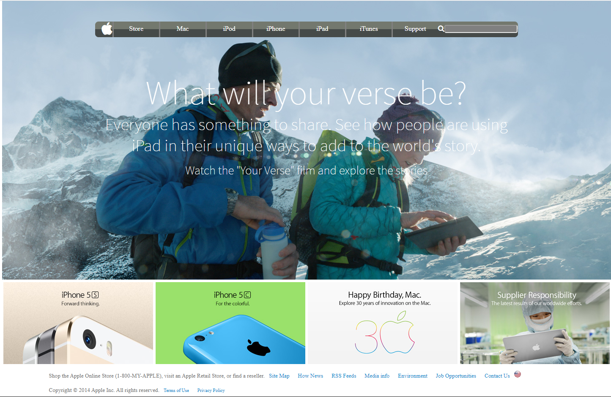

# Microverse HTML-CSS Project:  Apple Clone Page

> The following is a front-end copy of an old website of Apple. The main purpose of the project is to learn about backgrounds in CSS and Gradients

Additional description about the project and its features.
## Main features:

### Gradient Nav Bar

### Elements with a Background

### Vast use of flexbox

### Links Footer

## Built With

- HTML
- CSS

##  Live Demo Link
[link](https://rawcdn.githack.com/KennyUTN/Apple-ClonePage-Kenny/6e728d2a73b8b3601574e060b521fabf7baa6473/index.html)

## Authors

👤 **Ignacio Asis**

- Github:  @KennyUTN  [Go to profile](https://github.com/KennyUTN)

## 🤝 Contributing

Contributions, issues and feature requests are welcome!

Feel free to check the [issues page](https://github.com/KennyUTN/Apple-ClonePage-Kenny/issues).

## Show your support

Give a ⭐️ if you like this project!
